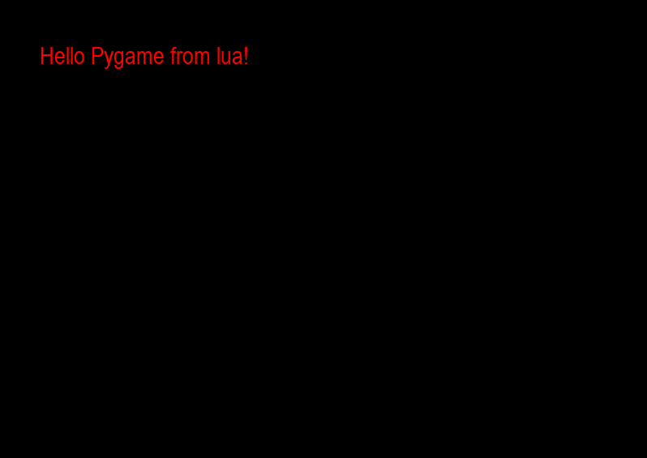
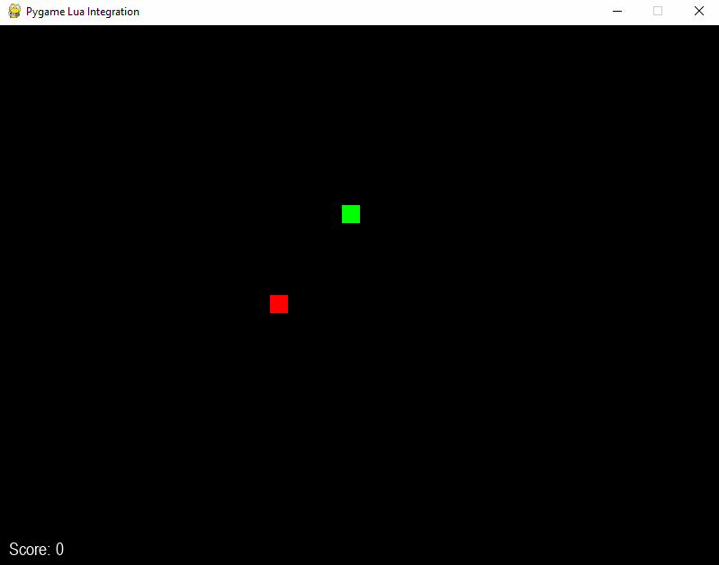

# Pygame Lua Integration

## Overview

This project attempts to map the most useful pygame functions in lua. Houses a neat system for Streamlined access to the pygame mainloop and events. The following demo gives an example on how simple this is:

## Demo

Lua (using pygame to lua bindings):
```lua
clear_canvas()
draw_text(50, 50, "Hello Pygame from lua!", "Arial", 30, 'red')
```

<div align="center">
    
</div>

Compare to vanilla pygame:
```python
import pygame
pygame.init()
screen = pygame.display.set_mode((800, 600))
font = pygame.font.SysFont('Arial', 30)
red = (124, 0, 0)
green = (0, 255, 0)
running = True
while running:
    for event in pygame.event.get():
        if event.type == pygame.QUIT:
            running = False
    screen.fill((0, 0, 0))
    screen.blit(font.render('Hello Pygame from python!', True, red), (50, 50))
    pygame.display.flip()
pygame.quit()
```
More in depth examples can be found on the [wiki](https://github.com/JakeTurner616/pygame-lua-bindings/wiki).

## Main loop handling from within lua
Assumes the use of high-level abstractions to register event handlers and inject control functions into the main loop. The following snake game provides a clear visualization of this process start to finish.
```lua
-- Game constants
local SCREEN_WIDTH, SCREEN_HEIGHT, TILE_SIZE = 800, 600, 20

-- Initialize game state
local snake = {{x = 10, y = 10}}
local food = {x = 15, y = 15}
local direction = {x = 1, y = 0}
local score = 0
local input_locked = false  -- Lock for input processing

-- Draw function
local function draw_game()
    clear_canvas()

    -- Draw snake
    for _, s in ipairs(snake) do
        draw_rectangle(s.x * TILE_SIZE, s.y * TILE_SIZE, TILE_SIZE, TILE_SIZE, "#00FF00")
    end

    -- Draw food
    draw_rectangle(food.x * TILE_SIZE, food.y * TILE_SIZE, TILE_SIZE, TILE_SIZE, "#FF0000")

    -- Draw score
    draw_text(10, SCREEN_HEIGHT - 30, "Score: " .. score, "Arial", 20, "#FFFFFF")

    flip_display()
end

-- Event handling
register_event_handler('on_keydown', function(event)
    if input_locked then return end  -- Ignore inputs if locked
    local key_map = {
        [K_RIGHT] = {1, 0},   -- Right arrow
        [K_LEFT] = {-1, 0},  -- Left arrow
        [K_UP] = {0, -1},  -- Up arrow
        [K_DOWN] = {0, 1}    -- Down arrow
    }
    local dir = key_map[event.key]
    if dir and (dir[1] ~= -direction.x and dir[2] ~= -direction.y) then
        direction = {x = dir[1], y = dir[2]}
        input_locked = true  -- Lock input until next update
    end
end)

-- Game logic
function process_events()
    for _, e in ipairs(get_events()) do
        if e.type == "QUIT" then
            stop_main_loop()
        end
    end
end

function update_position()
    -- Move snake
    local head = {x = snake[1].x + direction.x, y = snake[1].y + direction.y}

    -- Check collision with walls or self
    if head.x < 0 or head.x >= SCREEN_WIDTH / TILE_SIZE or
       head.y < 0 or head.y >= SCREEN_HEIGHT / TILE_SIZE or
       (#snake >= 4 and (function()
            for _, s in ipairs(snake) do
                if s.x == head.x and s.y == head.y then
                    return true
                end
            end
            return false
       end)()) then
        stop_main_loop()
    end

    -- Move snake
    table.insert(snake, 1, head)

    -- Check for food collision
    if head.x == food.x and head.y == food.y then
        score = score + 1
        food = {x = math.random(0, SCREEN_WIDTH / TILE_SIZE - 1), y = math.random(0, SCREEN_HEIGHT / TILE_SIZE - 1)}
    else
        table.remove(snake)
    end

    input_locked = false  -- Unlock input after updating
end

-- Register functions and start the loop
register_function("process_events", process_events)
register_function("update_position", update_position)
register_function("draw", draw_game)
start_main_loop()
```
<div align="center">
    
</div>

# Bound methods
All bound methods and their usage can be found on the [wiki page](https://github.com/JakeTurner616/pygame-lua-bindings/wiki)
